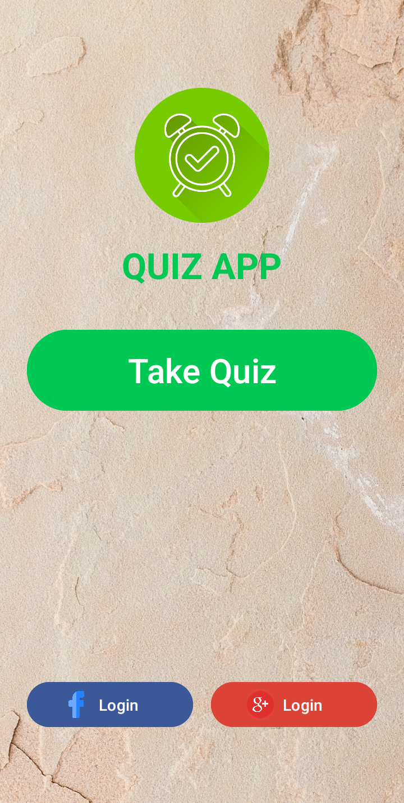
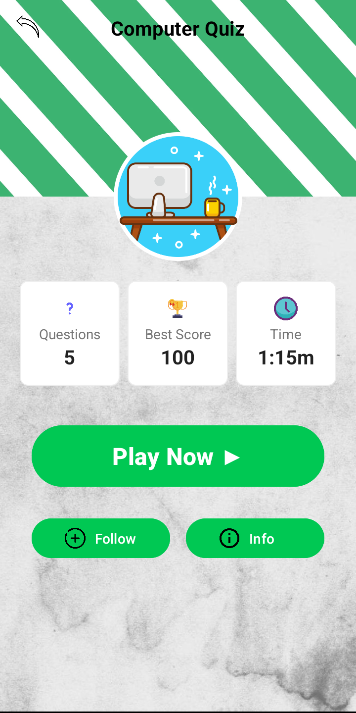

# Ứng dụng Quiz

Một ứng dụng câu đố (quiz) đơn giản nhưng hấp dẫn cho Android, cho phép người dùng kiểm tra kiến thức của họ về máy tính và công nghệ.

## Mô tả

Ứng dụng "Quiz App" được thiết kế với giao diện trực quan, thân thiện với người dùng, cho phép tham gia các bài kiểm tra kiến thức về máy tính. Người dùng có thể làm bài kiểm tra, xem điểm cao nhất và theo dõi thời gian hoàn thành.

## Tính năng chính
- Trả lời các câu hỏi trắc nghiệm về máy tính và công nghệ
- Theo dõi số câu hỏi, điểm số cao nhất và thời gian làm bài
- Đăng nhập bằng tài khoản Facebook hoặc Google
- Giao diện thân thiện với người dùng, trực quan và dễ sử dụng
- Theo dõi tiến độ học tập qua các bài kiểm tra

## Hình ảnh minh họa

### Màn hình chính của ứng dụng

### Màn hình vào game

## Cấu trúc ứng dụng
Ứng dụng bao gồm hai màn hình chính:
1. **Màn hình chính**: Hiển thị logo ứng dụng và các tùy chọn đăng nhập
   - Logo ứng dụng
   - Nút "Take Quiz" để bắt đầu
   - Các tùy chọn đăng nhập qua Facebook và Google

2. **Màn hình vào game**: Hiển thị thông tin về bài kiểm tra
   - Thông tin về số câu hỏi (Questions)
   - Điểm số cao nhất (Best Score)
   - Thời gian làm bài (Time)
   - Nút "Play Now" để bắt đầu làm bài
   - Các tùy chọn Follow và Info

## Luồng hoạt động
1. Người dùng mở ứng dụng và xem màn hình chính
2. Đăng nhập bằng tài khoản xã hội hoặc nhấn "Take Quiz" để tiếp tục
3. Xem thông tin về bài kiểm tra trên màn hình thứ hai
4. Nhấn "Play Now" để bắt đầu làm bài
5. Trả lời các câu hỏi và nhận điểm số cuối cùng

## Yêu cầu hệ thống
- Android 14.0 (API level 34 - "UpsideDownCake")
- Android Studio

## Cách cài đặt
1. Clone repository này về máy local
2. Mở dự án bằng Android Studio
3. Sync Gradle và build project
4. Chạy ứng dụng trên thiết bị thật hoặc máy ảo

## Công nghệ sử dụng
- Java
- Android SDK
- RelativeLayout và LinearLayout để tạo giao diện người dùng
- Xử lý sự kiện onClick
- Intent để chuyển đổi giữa các Activity

## Thiết kế giao diện
- Giao diện hiện đại với các màu sắc tươi sáng:
  - Màu chủ đạo: Xanh lá (#00C853)
  - Các nút có màu sắc phân biệt theo chức năng
- Bố cục hợp lý, dễ sử dụng với hiệu ứng chuyển đổi mượt mà

## Giấy phép
Dự án được phân phối dưới giấy phép MIT. Xem file `LICENSE` để biết thêm chi tiết.

## Tác giả
© 2025 - Được phát triển bởi Eggpant203 🍆

---
*Lưu ý: Đây là ứng dụng quiz đơn giản cho mục đích học tập. Mọi đóng góp và phản hồi đều được chào đón.*